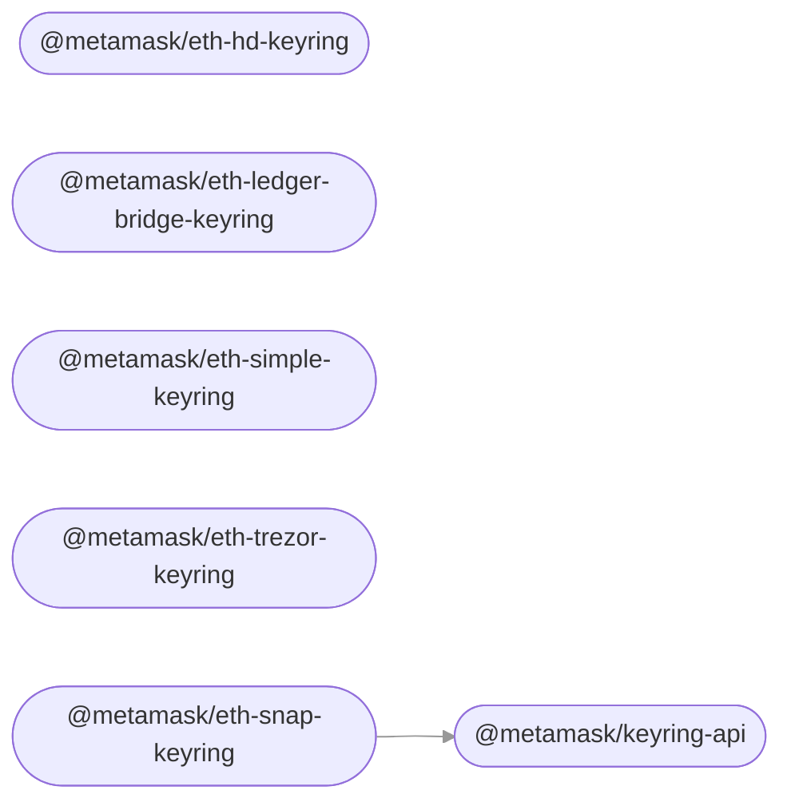

# Accounts Monorepo

This monorepo is a collection of accounts-related packages used across multiple MetaMask clients (e.g. [`metamask-extension`](https://github.com/MetaMask/metamask-extension/), [`metamask-mobile`](https://github.com/MetaMask/metamask-mobile/)).

## How to

- [How to release](./docs/how-to-release.md)

## Modules

This repository contains the following packages [^fn1]:

<!-- start package list -->

- [`@metamask/eth-hd-keyring`](packages/keyring-eth-hd)
- [`@metamask/eth-ledger-bridge-keyring`](packages/keyring-eth-ledger-bridge)
- [`@metamask/eth-simple-keyring`](packages/keyring-eth-simple)
- [`@metamask/eth-snap-keyring`](packages/keyring-snap)
- [`@metamask/eth-trezor-keyring`](packages/keyring-eth-trezor)
- [`@metamask/keyring-api`](packages/keyring-api)

<!-- end package list -->

Or, in graph form [^fn1]:

<!-- start dependency graph -->

<!-- end dependency graph -->

Refer to individual packages for usage instructions.

## Learn more

[^fn1]: The package list and dependency graph should be programmatically generated by running `yarn readme:update`.
